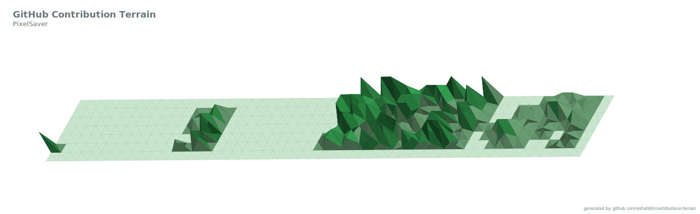

## Hi there 👋

<!--
**PixelSaver/PixelSaver** is a ✨ _special_ ✨ repository because its `README.md` (this file) appears on your GitHub profile.

Here are some ideas to get you started:

- 🔭 I’m currently working on ...
- 🌱 I’m currently learning ...
- 👯 I’m looking to collaborate on ...
- 🤔 I’m looking for help with ...
- 💬 Ask me about ...
- 📫 How to reach me: ...
- 😄 Pronouns: ...
- ⚡ Fun fact: ...

Look into:
* https://github.com/tipsy/profile-summary-for-github
* https://github.com/haidang666/awesome-tool-for-readme-profile
* https://github.com/satyawikananda/cardivo
* https://github.com/jstrieb/github-stats
* https://github.com/anmol098/waka-readme-stats
* https://github.com/athul/waka-readme
* https://github.com/gleich/profile_stack
* https://github.com/lowlighter/metrics
* https://github.com/Ileriayo/markdown-badges
* https://www.iconfinder.com
* https://shields.io
* https://devicon.dev
* https://rahuldkjain.github.io/gh-profile-readme-generator/
* https://github.com/rishavanand/github-profilinator
* https://github.com/DenverCoder1/readme-typing-svg
* ``

-->
